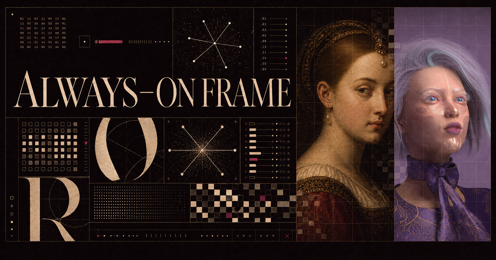

<div align="center">

<p><sub><strong>ALWAYS–ON / DIGITAL FRAME</strong></sub></p>

<h1>Always-On Frame</h1>

<h3>Turn an idle screen into a living frame.</h3>

<p>An ambient, exhibition-ready display for tablets, monitors, TVs, and kiosks.</p>

<p>
  <a href="https://joansterjo-celonis.github.io/Screensaver/"><strong>OPEN THE LIVE FRAME ↗</strong></a>
  &nbsp;&nbsp;·&nbsp;&nbsp;
  <a href="#frame-index">EXPLORE THE MODES</a>
  &nbsp;&nbsp;·&nbsp;&nbsp;
  <a href="#run-it-locally">RUN IT LOCALLY</a>
</p>

<p>
  <a href="https://github.com/joansterjo-celonis/Screensaver/actions/workflows/pages.yml"></a>
  
  
  
  
</p>

</div>

<a href="https://joansterjo-celonis.github.io/Screensaver/">
  
</a>

<br>

Always-On Frame is a quiet alternative to the blank screen: three slow, edge-to-edge visual programs wrapped in an interface that gets out of the way. Pick a field, enter fullscreen, and leave it running. The chosen mode stays with the device, controls fade when idle, and every new session reshuffles the program.

<table>
  <tr>
    <td align="center" width="25%"><strong>18</strong><br><sub>GENERATIVE SCENES</sub></td>
    <td align="center" width="25%"><strong>2,048</strong><br><sub>PUBLIC-DOMAIN PAINTINGS</sub></td>
    <td align="center" width="25%"><strong>269</strong><br><sub>POSTERJO ARTWORKS</sub></td>
    <td align="center" width="25%"><strong>5 MIN</strong><br><sub>GALLERY CADENCE</sub></td>
  </tr>
</table>

## Frame index

| Field | What fills the frame |
| --- | --- |
| `01` **Signal Field** | Eighteen generative canvas scenes made from glyphs, grids, orbital telemetry, waveforms, and deliberate glitches. Responsive, visibility-aware, and reduced-motion friendly. |
| `02` **Swikipedia** | A slow gallery spanning six centuries and 2,048 verified public-domain paintings. Each work arrives with its title, artist, date, and a concise Wikipedia description. |
| `03` **Posterjo** | Joan Sterjo's local high-resolution artwork archive: 269 compositions presented edge to edge with restrained titles and source metadata. |

## Built for the long gaze

| | |
| --- | --- |
| **Stay awake** | When supported, the frame requests Screen Wake Lock after interaction; fullscreen stays one key away. |
| **Keep going** | A service worker progressively caches artwork and preserves successful downloads. Swikipedia ships its 300-work core as local WebPs; Posterjo warming begins only when selected. |
| **Fit the room** | The frame adapts from portrait tablets to landscape TVs, respects safe areas, and keeps artwork composition-aware. |
| **Disappear quietly** | Controls auto-hide, rotations pause behind the index, and gallery works advance on an unhurried five-minute clock. |
| **Recover gracefully** | Each display mode has its own error boundary, and hidden tabs stop spending frames on animation. |
| **Remember the ritual** | The current mode and refreshed gallery copy are cached on-device; reopening the frame returns to where it belongs. |

## Controls

| Input | Action |
| --- | --- |
| <kbd>1</kbd> · <kbd>2</kbd> · <kbd>3</kbd> | Open Signal Field, Swikipedia, or Posterjo |
| <kbd>I</kbd> or <kbd>Esc</kbd> | Toggle the frame index |
| <kbd>F</kbd> | Enter fullscreen |
| <kbd>←</kbd> · <kbd>→</kbd> | Move through either gallery |
| Tap/click the left or right half | Previous or next artwork |

## Run it locally

Requires **Node.js 22.13 or newer**.

```bash
git clone https://github.com/joansterjo-celonis/Screensaver.git
cd Screensaver
npm install
npm run dev
```

Quality checks and a production run:

```bash
npm run lint
npm test

npm run build
npm run start
```

`npm test` creates a production build before running the rendered-output, interaction, layout, catalog, and archive integrity tests.

<details>
<summary><strong>Archive / provenance</strong></summary>

### Swikipedia

The committed painting inventory records the Wikimedia Commons revision, source dimensions, MIME type, SHA-1, public-domain evidence, and selection policy for every work. The first 300 paintings ship as optimized local WebPs; the other 1,748 use validated high-resolution Commons masters and are cached as they are viewed.

New catalog additions must have a short edge of at least 2,160 pixels, contain at least six megapixels, and keep every artist at eight works or fewer. Curatorial corrections live separately from the generated catalog so the collection remains reproducible.

| Command | Purpose |
| --- | --- |
| `npm run artworks:catalog` | Rebuild the curated 2,048-work catalog |
| `npm run artworks:sync` | Regenerate the 300-work local WebP core |
| `npm run artworks:verify` | Verify every committed local painting |

### Posterjo

The Posterjo snapshot contains 269 local artwork attachments from 241 ordered source records, newest first and ending at `newgen posterjo #1`. Its generated metadata and WebPs can be reproduced and checked independently.

| Command | Purpose |
| --- | --- |
| `npm run posterjo:sync` | Rebuild the local Posterjo archive |
| `npm run posterjo:verify` | Verify its files and generated metadata |

</details>

<details>
<summary><strong>System / map</strong></summary>

```text
app/
├── frame-app.tsx          mode index, wake lock, persistence, controls
├── modes/                 Signal Field, Swikipedia, Posterjo
└── data/                  generated catalogs and artwork URL helpers
public/
├── artworks/              300-work offline painting core
├── posterjo/              local Posterjo archive
└── sw.js                  progressive cache strategy
scripts/
├── data/                  reproducible source inventories
└── *.mjs                  catalog, sync, and verification pipelines
tests/                     rendered app and archive invariants
```

The interface is React 19 and Next.js 16, built through Vinext and Vite for Cloudflare-compatible output. Pushes to `main` verify both archives, create a static export with the `/Screensaver` base path, and publish `dist/client` to GitHub Pages.

</details>

<br>

<div align="center">
  <sub>BERLIN / ALWAYS–ON</sub>
  <br>
  <strong>Built to be looked at, not operated.</strong>
</div>
