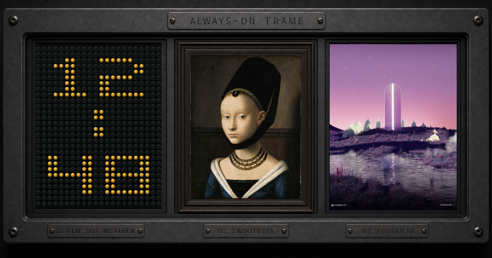

<div align="center">

<p><sub><strong>ALWAYS–ON / DIGITAL FRAME</strong></sub></p>

<h1>Always-On Frame</h1>

<h3>Turn an idle screen into a living frame.</h3>

<p>An ambient, exhibition-ready display for tablets, monitors, TVs, and kiosks.</p>

<p>
  <a href="https://joansterjo-celonis.github.io/Screensaver/"><strong>OPEN THE LIVE FRAME ↗</strong></a>
  &nbsp;&nbsp;·&nbsp;&nbsp;
  <a href="#frame-index">EXPLORE THE MODES</a>
  &nbsp;&nbsp;·&nbsp;&nbsp;
  <a href="#run-it-locally">RUN IT LOCALLY</a>
</p>

<p>
  <a href="https://github.com/joansterjo-celonis/Screensaver/actions/workflows/pages.yml"></a>
  
  
  
  
</p>

</div>

<a href="https://joansterjo-celonis.github.io/Screensaver/">
  
</a>

<p align="center"><sub>The social preview’s Flip Dot bay is a purpose-built 22×28 matrix of identical rotors. Its art bays use the verified archive sources <strong>Portrait of a Young Girl</strong> by Petrus Christus and the original 4K Posterjo work <strong>The monolith — 03.03.26</strong>.</sub></p>

<br>

Always-On Frame is a quiet alternative to the blank screen: three edge-to-edge display programs wrapped in an interface that gets out of the way. Pick a field, enter fullscreen, and leave it running. The chosen mode stays with the device, controls fade when idle, and each new session reshuffles the artwork galleries.

<table>
  <tr>
    <td align="center" width="25%"><strong>15 MIN</strong><br><sub>WEATHER REFRESH</sub></td>
    <td align="center" width="25%"><strong>2,048</strong><br><sub>PUBLIC-DOMAIN PAINTINGS</sub></td>
    <td align="center" width="25%"><strong>269</strong><br><sub>POSTERJO ARTWORKS</sub></td>
    <td align="center" width="25%"><strong>5 MIN</strong><br><sub>GALLERY CADENCE</sub></td>
  </tr>
</table>

## Frame index

| Field | What fills the frame |
| --- | --- |
| `01` **Flip Dot Weather** | A single mechanical 24-hour hours-and-minutes field with a separate flat-icon weather instrument for any searchable city or postcode. Four saved pigment/chassis themes and NORMAL/BOLD numeral weights tune the hardware without changing its rotor geometry. |
| `02` **Swikipedia** | A slow gallery spanning six centuries and 2,048 verified public-domain paintings. Each work arrives with its title, artist, date, and a concise Wikipedia description. |
| `03` **Posterjo** | Joan Sterjo's local high-resolution artwork archive: 269 compositions presented edge to edge with restrained titles and source metadata. |

## Built for the long gaze

| | |
| --- | --- |
| **Stay awake** | When supported, the frame requests Screen Wake Lock after interaction; fullscreen stays one key away. |
| **Keep going** | A service worker progressively caches artwork and preserves successful downloads. Swikipedia ships its 300-work core as local WebPs; Posterjo warming begins only when selected. Flip Dot Weather keeps its selected location and latest successful matching forecast on-device. |
| **Fit the room** | The frame adapts from portrait tablets to landscape TVs, respects safe areas, and keeps artwork composition-aware. |
| **Disappear quietly** | Controls auto-hide, weather refreshes every 15 minutes while active, and gallery works keep their unhurried five-minute clock. Opening the index pauses the display beneath it. |
| **Recover gracefully** | Each display mode has its own error boundary. If live weather cannot refresh, the last matching snapshot remains visible as `SAVED`; without one, the board stays usable as a local clock and marks conditions `OFFLINE`. |
| **Remember the ritual** | The current mode, selected weather location, latest successful weather snapshot, flip-dot theme, numeral weight, and refreshed gallery copy are cached on-device; reopening the frame returns to where it belongs. |

## Controls

| Input | Action |
| --- | --- |
| <kbd>1</kbd> · <kbd>2</kbd> · <kbd>3</kbd> | Open Flip Dot Weather, Swikipedia, or Posterjo |
| <kbd>I</kbd> or <kbd>Esc</kbd> | Toggle the frame index; <kbd>Esc</kbd> closes the location picker first when it is open |
| <kbd>F</kbd> | Enter fullscreen |
| <kbd>←</kbd> · <kbd>→</kbd> | Step through either artwork gallery |
| Tap/click the left or right half of a gallery | Show the previous or next artwork |
| Flip Dot Weather city / `CHANGE` | Open the location picker; search a city or postcode with at least three characters |
| Flip Dot Weather `DOT / CHASSIS` | Cycle Amber/Graphite, Ivory/Navy, Vermilion/Bakelite, or Mint/Gunmetal; the choice is saved on this device |
| Flip Dot Weather `WEIGHT` | Toggle NORMAL/BOLD numeral strokes; the choice is saved on this device |
| Location picker `QUICK SELECT` | Choose Berlin, London, New York, Tokyo, or Sydney without searching |

## Flip Dot Weather

The first field is a browser-built mechanical board, not an image or video loop. Its 24-hour hours-and-minutes display is stamped into one uninterrupted field of identically sized DOM/CSS rotors: 43×19 in landscape and 27×42 in tall portrait. There is no seconds readout; the separator alone pulses once per second when motion is enabled. The saved NORMAL/BOLD control thickens the numeral strokes by activating more rotors, never by enlarging individual dots. The portrait composition stacks hours above minutes so a 9:16 frame remains legible and physical instead of shrinking a landscape dashboard. Temperature, the readable flat weather icon, and local date remain in the external instrument rails, leaving the recessed dot cavity as one clean tactile surface. The selected location’s IANA timezone drives the 24-hour clock and local date.

Tap the city name to search by city or postcode. Searches return up to six matches from the Open-Meteo Geocoding API; the five built-in presets remain available as a quick start. A selection is saved in browser storage and is restored on the next visit. The app does not request the device’s physical location.

Current conditions load when the mode becomes active, refresh every 15 minutes, and refresh after returning to a visible tab when the prior update is at least 15 minutes old. The latest successful response is stored only for the matching selected location. A failed request leaves saved conditions on screen with a `SAVED` indicator; snapshots older than 30 minutes are also marked `SAVED`. When no usable snapshot exists, weather values show placeholders with an `OFFLINE` indicator while the local clock continues to run.

The interface type is bundled with the app through Fontsource, so it makes no runtime font request. All three families are free to use under the [SIL Open Font License 1.1](https://openfontlicense.org/open-font-license-official-text/).

| Typeface | Role | Attribution |
| --- | --- | --- |
| **Oxanium Variable** | Manufacturer marks, date, and weather readouts | [Oxanium on Google Fonts](https://fonts.google.com/specimen/Oxanium) · SIL OFL 1.1 |
| **Rajdhani** | Condensed headings, city names, and condition labels | [Rajdhani on Google Fonts](https://fonts.google.com/specimen/Rajdhani) · SIL OFL 1.1 |
| **IBM Plex Mono** | Board labels, controls, status, and technical data | [IBM Plex Mono on Google Fonts](https://fonts.google.com/specimen/IBM+Plex+Mono) · SIL OFL 1.1 |

### Weather data, attribution, and API use

- Live values come from the [Open-Meteo Forecast API](https://open-meteo.com/en/docs). Its “current” conditions are model-derived 15-minute data, not guaranteed readings from a nearby physical station. This interface rounds values for display and maps WMO weather codes to its own local labels and CSS-rendered flat instrument icons.
- Location search uses the [Open-Meteo Geocoding API](https://open-meteo.com/en/docs/geocoding-api), whose location database comes from [GeoNames](https://www.geonames.org/). Both providers are credited beside the weather board.
- Open-Meteo API data are offered under [CC BY 4.0](https://open-meteo.com/en/license), which requires attribution, a licence link, and disclosure of modifications. Open-Meteo does not guarantee data accuracy, completeness, availability, or uninterrupted service.
- This static client calls Open-Meteo’s public HTTPS endpoints directly and contains no API key. Under the current [Open-Meteo terms](https://open-meteo.com/en/terms), the free endpoints are limited to non-commercial use and fewer than 10,000 calls per day, 5,000 per hour, and 600 per minute. Review those terms before deploying a fork.
- Commercial use requires an appropriate [Open-Meteo API plan](https://open-meteo.com/en/pricing). Never place a paid API key in this public browser bundle: GitHub Pages cannot keep secrets, so a commercial deployment needs a protected server-side integration for the customer endpoint.
- Search text, selected coordinates, and ordinary request metadata are sent from the browser to Open-Meteo when those APIs are used. The locally stored selection and weather snapshot remain in that browser unless the user clears site data.

## Run it locally

Requires **Node.js 22.13 or newer**.

```bash
git clone https://github.com/joansterjo-celonis/Screensaver.git
cd Screensaver
npm install
npm run dev
```

Quality checks and a production run:

```bash
npm run lint
npm test

npm run build
npm run start
```

`npm test` creates a production build before running the rendered-output, interaction, layout, catalog, and archive integrity tests.

<details>
<summary><strong>Archive / provenance</strong></summary>

### Swikipedia

The committed painting inventory records the Wikimedia Commons revision, source dimensions, MIME type, SHA-1, public-domain evidence, and selection policy for every work. The first 300 paintings ship as optimized local WebPs; the other 1,748 use validated high-resolution Commons masters and are cached as they are viewed.

New catalog additions must have a short edge of at least 2,160 pixels, contain at least six megapixels, and keep every artist at eight works or fewer. Curatorial corrections live separately from the generated catalog so the collection remains reproducible.

| Command | Purpose |
| --- | --- |
| `npm run og:build` | Rebuild the social preview from its exact flip-dot geometry and verified Posterjo source |
| `npm run artworks:catalog` | Rebuild the curated 2,048-work catalog |
| `npm run artworks:sync` | Regenerate the 300-work local WebP core |
| `npm run artworks:verify` | Verify every committed local painting |

### Posterjo

The Posterjo snapshot contains 269 local artwork attachments from 241 ordered source records, newest first and ending at `newgen posterjo #1`. Its generated metadata and WebPs can be reproduced and checked independently.

| Command | Purpose |
| --- | --- |
| `npm run posterjo:sync` | Rebuild the local Posterjo archive |
| `npm run posterjo:verify` | Verify its files and generated metadata |

</details>

<details>
<summary><strong>System / map</strong></summary>

```text
app/
├── frame-app.tsx          mode index, wake lock, persistence, controls
├── modes/
│   ├── flip-dot-clock.tsx clock, location picker, refresh and saved fallback
│   ├── flip-dot-glyphs.ts local 5×7 flip-dot alphabet
│   ├── flip-dot-layout.ts normal/bold hour-minute matrix composition
│   ├── flip-dot-themes.ts saved pigment and chassis themes
│   ├── flip-dot-weights.ts saved normal/bold numeral preference
│   ├── weather-data.ts    Open-Meteo requests, response parsing, WMO mapping
│   ├── gallery.tsx        Swikipedia display
│   └── posterjo.tsx       Posterjo display
└── data/                  generated catalogs and artwork URL helpers
public/
├── artworks/              300-work offline painting core
├── posterjo/              local Posterjo archive
└── sw.js                  progressive cache strategy
scripts/
├── data/                  reproducible source inventories
└── *.mjs                  catalog, sync, and verification pipelines
tests/                     rendered app and archive invariants
```

The interface is React 19 and Next.js 16, built through Vinext and Vite for Cloudflare-compatible output. Pushes to `main` verify both archives, create a static export with the `/Screensaver` base path, and publish `dist/client` to GitHub Pages.

</details>

<br>

<div align="center">
  <sub>BERLIN / ALWAYS–ON</sub>
  <br>
  <strong>Built to be looked at, not operated.</strong>
</div>
